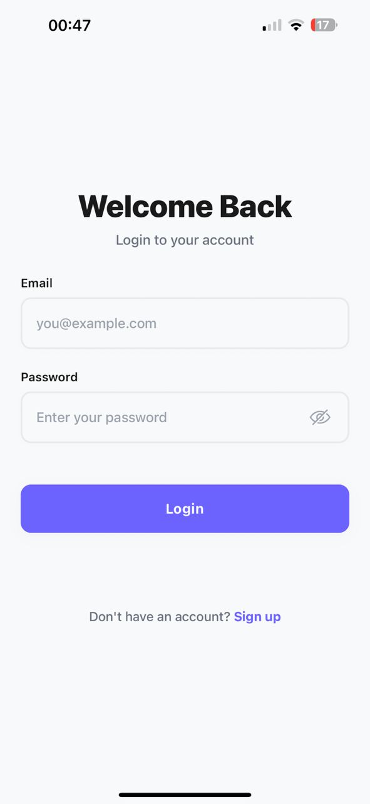
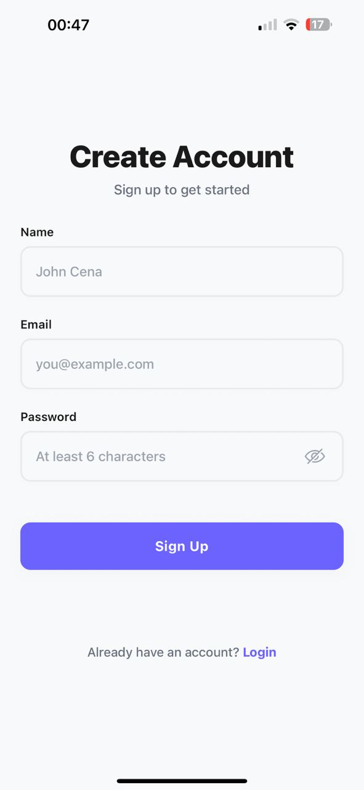

# 🔐 User Authentication App

A production-ready React Native authentication app with TypeScript, demonstrating clean architecture patterns and best practices for mobile development.


---

## 📸 Screenshots & Demo

### App Screens

<p align="center">
  
  
  
</p>

### Full Demo Video

https://github.com/user-attachments/assets/5f21be87-19fe-41fe-93b5-65cc3b68eb0b

### VoiceOver Feature

- Reads UI elements out loud
- Lets visually impaired users navigate by swiping
- Announces what a button does, not how it looks

https://github.com/user-attachments/assets/6992ae56-c788-4388-909c-c7b4573b44de

---

## 📱 Features

### ✅ **Core Functionality**

- **User Signup** - Create account with name, email, and password
- **User Login** - Secure authentication with credential verification
- **Multi-User Support** - Multiple accounts can be registered and logged into
- **Auto-Login** - Persistent sessions with automatic re-authentication on app restart
- **Secure Logout** - Clear session management

### 🎨 **UI/UX**

- **Modern Design** - Clean purple-themed interface with smooth animations
- **Password Toggle** - Show/hide password visibility with eye icons
- **Form Validation** - Real-time validation with helpful error messages
- **Loading States** - Visual feedback during async operations
- **Error Handling** - Graceful error displays with user-friendly messages
- **Keyboard Management** - Proper keyboard avoidance and input handling

### 🛡️ **Security & Best Practices**

- **Password Hashing** - SHA-256 encryption (never stores plaintext)
- **Input Sanitization** - Protection against XSS and malicious input
- **Email Normalization** - Consistent email handling (lowercase, trimmed)
- **Error Boundary** - Prevents app crashes with graceful error recovery
- **Accessibility** - Full screen reader support (VoiceOver/TalkBack)

### ⚡ **Performance**

- **Optimized Re-renders** - React hooks optimization (useCallback, useMemo)
- **Race Condition Prevention** - Proper cleanup in async operations
- **Type Safety** - Strict TypeScript mode for compile-time error catching

---

## 🏗️ Architecture

Built with **clean architecture principles** and **production-ready patterns**:

```
┌─────────────────┐
│   Screens (UI)  │  ← Thin presentation layer
└────────┬────────┘
         │
┌────────▼────────┐
│  AuthContext    │  ← State management (Context API)
└────────┬────────┘
         │
┌────────▼────────┐
│  AuthService    │  ← Business logic
└────────┬────────┘
         │
┌────────▼────────┐
│ AuthRepository  │  ← Data access layer
└────────┬────────┘
         │
┌────────▼────────┐
│ Storage/Crypto  │  ← Infrastructure
└─────────────────┘
```

**Key Design Patterns:**

- **Repository Pattern** - Abstracted data layer (easy to swap AsyncStorage → API)
- **Context API** - Global state management without Redux overhead
- **Auth Gating** - Navigation controlled at root level for security
- **Dependency Separation** - Clean boundaries between layers

---

## 🚀 Quick Start

### Prerequisites

- Node.js 18+ and npm/yarn
- Expo CLI: `npm install -g expo-cli`
- iOS Simulator (Mac) or Android Emulator

### Installation

```bash
# Clone the repository
git clone https://github.com/FarisHariri1336/userAuthApp.git
cd UserAuthApp

# Install dependencies
yarn install
# or
npm install
```

### Running the App

```bash
# Start Expo development server
yarn start

# Run on iOS Simulator
yarn ios

# Run on Android Emulator
yarn android

# Run in web browser
yarn web
```

### Running Tests

```bash
# Run all tests
yarn test

# Run tests in watch mode
yarn test --watch
```

---

## 📦 Tech Stack

| Category             | Technology                          |
| -------------------- | ----------------------------------- |
| **Framework**        | React Native (Expo SDK 54)          |
| **Language**         | TypeScript 5.9 (strict mode)        |
| **State Management** | React Context API                   |
| **Navigation**       | React Navigation 7 (Native Stack)   |
| **Storage**          | AsyncStorage (local persistence)    |
| **Security**         | expo-crypto (SHA-256 hashing)       |
| **Testing**          | Jest + React Native Testing Library |
| **Code Quality**     | TypeScript, ESLint                  |

---

## 📂 Project Structure

```
src/
├── features/
│   └── auth/
│       ├── AuthContext.tsx       # Global auth state
│       ├── AuthService.ts        # Business logic
│       ├── AuthRepository.ts     # Data access
│       ├── validators.ts         # Input validation
│       ├── sanitizers.ts         # Input sanitization
│       ├── types.ts              # TypeScript types
│       └── errors.ts             # Error handling
│
├── screens/
│   ├── LoginScreen.tsx           # Login UI
│   ├── SignupScreen.tsx          # Signup UI
│   └── HomeScreen.tsx            # User home page
│
├── navigation/
│   ├── RootNavigator.tsx         # Auth gating
│   ├── AuthStack.tsx             # Unauthenticated screens
│   └── AppStack.tsx              # Authenticated screens
│
└── shared/
    ├── components/
    │   ├── TextField.tsx         # Reusable input field
    │   ├── PrimaryButton.tsx     # Reusable button
    │   ├── ErrorText.tsx         # Error display
    │   ├── ErrorBoundary.tsx     # Error recovery
    │   └── Screen.tsx            # Screen wrapper
    │
    ├── theme/
    │   ├── colors.ts             # Color palette
    │   ├── spacing.ts            # Spacing system
    │   └── icons.ts              # Icon assets
    │
    ├── storage/
    │   └── storage.ts            # AsyncStorage wrapper
    │
    └── crypto/
        └── crypto.ts             # Password hashing
```

---

## 🔑 Key Implementation Details

### Authentication Flow

**Signup:**

1. Validate inputs (email format, password strength, required fields)
2. Sanitize user input (remove special characters, normalize email)
3. Check for duplicate email addresses
4. Hash password with SHA-256
5. Store user data and create session
6. Auto-navigate to Home screen

**Login:**

1. Validate credentials format
2. Sanitize email input
3. Find user by normalized email
4. Verify password hash
5. Create new session
6. Auto-navigate to Home screen

**Auto-Login (Bootstrap):**

1. On app launch, check for existing session
2. Load user data from session
3. If valid → redirect to Home
4. If invalid → clear session and show Login

### Data Persistence

**Storage Keys:**

- `AUTH_USERS_V1`: Array of all registered users
- `AUTH_SESSION_V1`: Current user session

**Data Models:**

```typescript
User {
  id: string;           // UUID
  name: string;         // Sanitized
  email: string;        // Normalized (lowercase, trimmed)
  passwordHash: string; // SHA-256 hash
  createdAt: string;    // ISO timestamp
}

Session {
  userId: string;
  createdAt: string;
}
```

---

## 🧪 Testing

**Unit Tests:**

- ✅ Validators (email, password, required fields)
- ✅ AuthService (signup, login, logout, bootstrap)
- ✅ Input sanitization
- ✅ Error handling

**Manual Testing Checklist:**

- [ ] Signup with valid credentials
- [ ] Login with correct password
- [ ] Logout and verify session cleared
- [ ] App restart auto-login
- [ ] Multi-user account switching
- [ ] Form validation errors
- [ ] Password visibility toggle
- [ ] Screen reader navigation

---

## 📝 Development Notes

### Why No Backend?

This is a **local-only assessment** demonstrating frontend architecture. The repository pattern makes it trivial to swap `AuthRepository` from AsyncStorage to a real API.

**Production Considerations:**

- Use platform secure storage (iOS Keychain, Android Keystore)
- Implement salted password hashing (bcrypt/argon2) server-side
- Add JWT token authentication
- Implement refresh tokens
- Add session expiration
- Use HTTPS for API calls

### Why Context API Instead of Redux?

For this scope, Context API provides:

- ✅ Cleaner code with less boilerplate
- ✅ Easier to understand and maintain
- ✅ Sufficient for auth state management
- ✅ Better performance for simple state

---

## 🤝 Contributing

This is an assessment project, but suggestions are welcome!

---

## 📄 License

This project is created for assessment purposes.

---

## 👤 Author

**Faris Hariri**

---

**Built with ❤️ using React Native + TypeScript**
